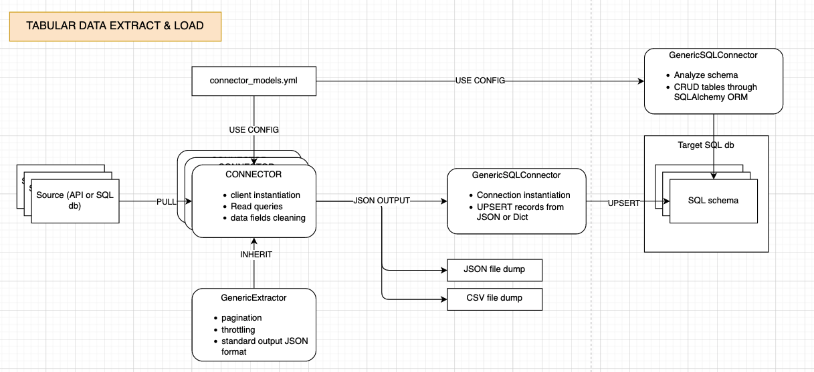
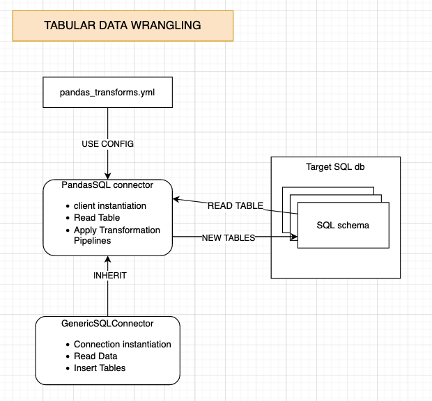
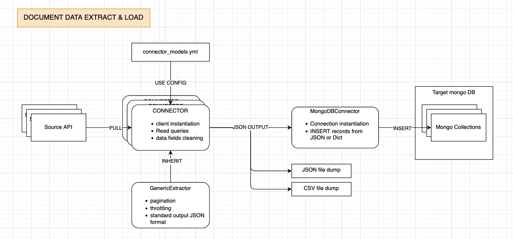
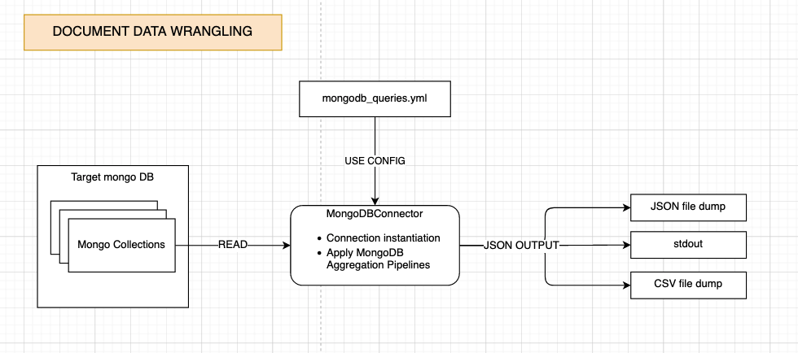
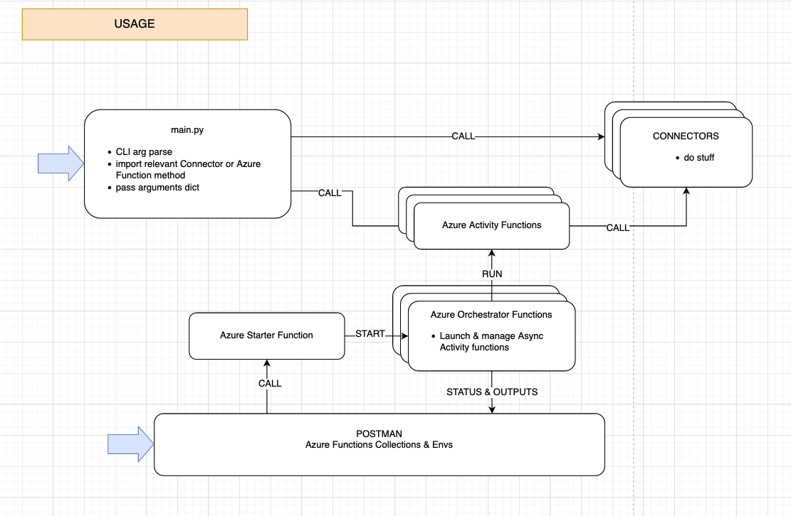

# documentation

# Main Use Cases

kspyder is a lightweight and very simple Python ETL framework. It was designed originally to fit the needs of an SMB for very simple-to-configure and simple-to-operate data pipelines.

The main concern (and first use case) was to be able to extract data from either SQL or API Data Sources and store it in an SQL database that would be used for Business Data analysis (typically through MS PowerBI or Tableau), and to be able to :

- Strip out any potential PII from that data before persisting it to the target database that would be accessible to Data Analysts
- Manage Throttling and Pagination in a simple way without having to re-code it for each new Data Source
- Iterate A LOT on the definition and/or transformation of Target database schemas and tables used by Data Analysts, with minimal code modification
- Industrialize and secure the execution of that ETL with a Cloud-based Orchestration service.
- ALL data transient in the pipelines AND stored in the target DBs have to be considered entirely expendable : the target DBs should be allowed to be destroyed and recreated/repopulated at any point without consequences for the business

Since then needs to manage more flexible, document-type data have arisen but the goals remain the same : manage ETL through simple configurations and persist the outputs on a flexible DB schema. 

There are two current use cases for getting and using document-type data :

- Perform richer analysis on non-tabular data (typically JSON data from Cloud REST APIs) for Cloud systems analysis : gracefully visualize Route Tables in a Cloud Virtual Network, or view how specific options are propagated to VMs...
- Get aggregated views of Cloud Resources for workload and FinOps analysis

# Technologies used

kspyder is 100% Python.

- Management of the SQL-type schema definitions is done through a wrapper leveraging the SQLAlchemy ORM
- Most connectors, either to APIs or DBs (SQL qnd mongoDB), are simple Python classes, some of them using more generic Interface
- The original choice for Cloud-based, Async Orchestration was [Azure Durable Functions](https://docs.microsoft.com/en-us/azure/azure-functions/durable/durable-functions-overview?tabs=csharp), but the code can be adapted to leverage other orchestration frameworks
- For Transform and Wrangling of tabular (SQL-type) data, a pandas wrapper class is used
- All configurations (API connectors, SQL wrappers, pandas transformation pipelines, mongoDB aggregation pipelines) are managed by parsing simple YAML files placed in a configuration folder

# Flow : Tabular Data Extract & Load

The main principles are : 

- One Data Source (SQL or API) = one SQL schema in the Target database
- One schema = several "Models" (= SQL Tables)
- For each Source=schema, one Connector instantiation, all using one YAML configuration file ("connector_models.yml" in the "manifests" folder)
- The Connector inherits from a GenericExtractor interface that provides pagination, throttling and standard dict-type output formats
- The Connector outputs JSON data through stdout that can be dumped to local JSON files or local CSV files as well, depending on the global config
- If Models in the YAML config change :
    - Several methods using SQLAlchemy have to be triggered, to alter or recreate entire tables in the Target db accordingly
    - outputs from the Connector will change accordingly at next run without any further action needed

This section of documentation is to be completed, but the main info are as follows in this diagram.

# Flow : Tabular Data Transform

Transforming data from the Target SQL db is done by a pandas wrapper (pandasSQL.py) :

- Inherits SQL db connections from the generic SQL interface
- Reads tables
- Executes series of transformations defined through YAML config - pretty much like a CI/CD pipeline definition
- Outputs of these pipelines are saved to the Target DB as new tables

# Flow : Document-data Extract & Load

The principles are pretty much the same than for Tabular data sources, but simpler as mongoDB does not need pre-defined schemas and tables.

# Flow : Document-data Aggregation

Very simple mongoDB aggregation pipelines are used to get outputs from the mongodb Collections, stored to JSON and/or CSV files at the moment. Aggregation pipelines are defined in a YAML config file.

# Usage : CLI & Orchestration

Local usage : the main.py file defines a simple CLI argument parser and passes input arguments in a standard dict format to further functions : either Connectors directly, or to Azure Activity functions when relevant.

Remote usage : [Azure Durable Functions](https://docs.microsoft.com/en-us/azure/azure-functions/durable/durable-functions-overview?tabs=csharp) can be used and deployed to your Azure tenant. There are Postman collections you can use to trigger one-shot activites like Extract & Load, Tabular Transform, or management of the Target DB SQL schemas. There is a Timer Function tha, if deployed to your Azure tenant, will run regular Activity orchestration.

To get the Postman collections, email me :)

